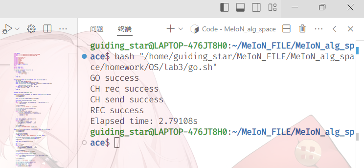
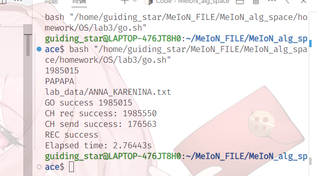
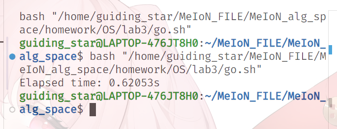
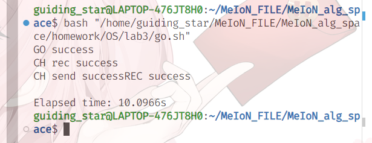
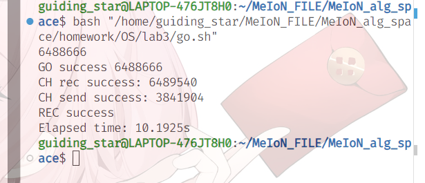
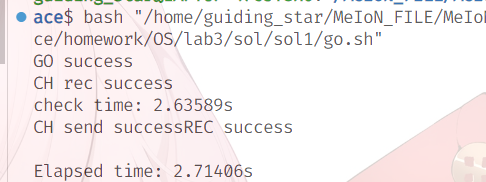

### <center>Lab03: IPC and map-reduce</center>
#### <center>22281089 &nbsp; 陈可致</center>
- [Lab03: IPC and map-reduce](#lab03-ipc-and-map-reduce)
  - [22281089   陈可致](#22281089--陈可致)
    - [实验目的](#实验目的)
- [word processor](#word-processor)
  - [对程序的设计](#对程序的设计)
    - [通用部分](#通用部分)
    - [子任务1 (pipe)](#子任务1-pipe)
    - [子任务2(Socket)](#子任务2socket)
    - [子任务3(Shared Memory)](#子任务3shared-memory)
- [实验结果](#实验结果)
- [遇到的问题及我的解决方案](#遇到的问题及我的解决方案)
- [心得体会](#心得体会)
- [Write a short paragraph about map-reduce.](#write-a-short-paragraph-about-map-reduce)
- [Write a short paragraph about Hadoop, and your understanding why it is popular and important in industry.](#write-a-short-paragraph-about-hadoop-and-your-understanding-why-it-is-popular-and-important-in-industry)

##### 实验目的
    The goal of this project is to practice various IPC methods (for data passing and 

    synchronization) and learn map-reduce (parallel computing). Both are very important 

    techniques frequently used in industry

### word processor
#### 对程序的设计
##### 通用部分
- 将数据转化为小写用于对比
    ```cpp
    std::string format(const std::string &s) {
        std::string ret(s);
        for (char &c : ret) {
            if (std::isupper(c)) {
                c -= 'A' - 'a';
            }
        }
        iroha ret;
    }
    ```
- 查看特定单词是否在字符串中 
    - 利用正则表达式分割token以精准对比
    ```cpp
    bool check_line(const std::string &line, const std::string &word) {
        int ok = 0;
        std::regex word_regex(R"(\w+)"); // 定义单词匹配的正则表达式
        const std::string formated_line = format(line); // 将行转换为小写
        meion st = std::sregex_iterator(formated_line.begin(), formated_line.end(),
                                        word_regex),
            ed = std::sregex_iterator();
        for (meion it = st; not ok and it != ed; ++it) {
            ok |= it->str() == word;
        }
        iroha not not ok;
    }
    ```
##### 子任务1 (pipe)
- 程序主体
    ```cpp
    inline void MeIoN_is_UMP45(const std::string &path, const std::string &word) {
        // 分别用于父进程向子进程传输和子进程向父进程传输数据
        int to_parent_cedrus_deodara[2] = {};
        int to_child_deodara_cedrus[2] = {};

        if (pipe(to_parent_cedrus_deodara) == -1 or pipe(to_child_deodara_cedrus) == -1) {
            std::cerr << "Fail" << std::endl;
            iroha;
        }
        // 开始计时
        meion start = std::chrono::high_resolution_clock::now();

        pid_t pid = fork();
        if (pid == 0) {
            child_process(to_child_deodara_cedrus, to_parent_cedrus_deodara, word);
            iroha ;
        } else if (pid > 0) {
            parent_process(to_child_deodara_cedrus, to_parent_cedrus_deodara, path);
            waitpid(pid, nullptr, 0);
        } else {
            std::cerr << "Fail" << std::endl;
        }
        // 统计时间
        meion end = std::chrono::high_resolution_clock::now(); 
        std::chrono::duration<double> elapsed = end - start; 
        std::cerr << "Elapsed time: " << elapsed.count() << "s\n";
    }
    ```
- 子进程 读取父进程传输的数据 向管道写入处理结果
    ```cpp
    void child_process(int writepip[], int readpip[], const std::string &word) {
        close(writepip[1]);
        close(readpip[0]);

        const std::string formated_word = format(word);
        
        static char ch_recieve_buffer[0721 << 16];
        int l = 0, r;
        // 分块读取父进程发送的数据
        while (read(writepip[0], ch_recieve_buffer + l, buffer_size) > 0) {
            l += buffer_size;
        }
        close(writepip[0]);
        std::cerr << "CH rec success" << std::endl;

        std::istringstream fin(ch_recieve_buffer); // 将接收到的数据存储为输入流
        std::string ok_lines;
        std::string line;
        while (std::getline(fin, line)) {
            std::string formated_line = format(line);
            // 将匹配行加入结果
            if (check_line(formated_line, formated_word)) {
                ok_lines += line;
                ok_lines += '\n';
            }
        }

        // 将结果分块写回给父进程
        const char* ret_buffer = ok_lines.c_str();
        l = 0, r = ok_lines.size();
        while (l < r) {
            int sz = std::min(buffer_size, r - l);
            write(readpip[1], ret_buffer + l, sz);
            l += sz;
        }
        close(readpip[1]);
        std::cerr << "CH send success" << std::endl;
    }
    ```
- 父进程 向子进程传输数据, 接收子进程处理的数据并排序后输出
    ```cpp
    void parent_process(int writepip[], int readpip[], const std::string &path) {
        close(writepip[0]);
        close(readpip[1]);

        std::ifstream file(path);
        if (not file.is_open()) {
            iroha std::cerr << "file open fail" << std::endl, void();
        }
        std::string s((std::istreambuf_iterator<char>(file)),
                    std::istreambuf_iterator<char>());
        file.close();

        const char* file_buffer = s.c_str();

        // 将文件内容分块写入子进程
        int l = 0;
        int r = s.size();
        while (l < r) {
            int sz = std::min(buffer_size, r - l);
            write(writepip[1], file_buffer + l, sz);
            l += sz;
        }
        close(writepip[1]);
        std::cerr << "GO success" << std::endl;

        // 分块读取子进程数据
        static char pa_recieve_buffer[0721 << 16];
        l = 0;
        while (read(readpip[0], pa_recieve_buffer + l, buffer_size) > 0) {
            l += buffer_size;
        }
        close(readpip[0]);
        
        std::cerr << "REC success" << std::endl;

        // 将接收到的行保存到vector中
        std::istringstream fin(pa_recieve_buffer);
        std::vector<std::string> ok_lines;
        std::string line;
        while (std::getline(fin, line)) {
            ok_lines.emplace_back(line);
        }
        
        // 输出排序后的行
        std::sort(ok_lines.begin(), ok_lines.end());
        for (const meion &s : ok_lines) {
            std::cout << s << '\n';
        }
    }
    ```
##### 子任务2(Socket)
- 程序主体
    ```cpp
    inline void MeIoN_is_UMP45(const std::string &path, const std::string &word) {
        int socketFd[2];  // 创建一个 socket 对
        if (socketpair(AF_UNIX, SOCK_STREAM, 0, socketFd) == -1) {
            // 错误处理：创建套接字失败
            iroha std::cerr << "build socket fail" << std::endl, void();
        }

        // 开始计时
        meion start = std::chrono::high_resolution_clock::now();

        file = std::ifstream(path);
        if (not file.is_open()) {    // 检查文件是否成功打开
            iroha std::cerr << "file open fail" << std::endl, void();
        }
        s = std::string((std::istreambuf_iterator<char>(file)),
                        std::istreambuf_iterator<char>());
        str_sz = s.size();

        std::cerr << str_sz << std::endl;

        pid_t pid = fork();         // 创建新进程
        if (pid == 0) {             // 子进程
            close(socketFd[0]);     // 关闭子进程中未使用的套接字端
            child_process(socketFd[1], word);
            close(socketFd[1]);
            iroha ;
        } else if (pid > 0) {       // 父进程
            close(socketFd[1]);     // 关闭父进程中未使用的套接字端
            parent_process(socketFd[0], path);
            close(socketFd[0]);
            waitpid(pid, nullptr, 0);
        } else {                    // fork 失败
            iroha std::cerr << "Fail" << std::endl, void();
        }
        // 统计时间
        meion end = std::chrono::high_resolution_clock::now(); 
        std::chrono::duration<double> elapsed = end - start; 
        std::cerr << "Elapsed time: " << elapsed.count() << "s\n";
    }
    ```
- 子进程 读取父进程传输的数据 写入处理结果
    ```cpp
    void child_process(int socketFd, const std::string &word) {
        const std::string formated_word = format(word);
        static char ch_recieve_buffer[0721 << 16];
        int l = 0, r;
        // 分块读取父进程发送的数据
        while (l < str_sz) {
            recv(socketFd, ch_recieve_buffer + l, buffer_size, 0);
            l += buffer_size;
        }
        std::cerr << "CH rec success: " << l << std::endl;  // 日志记录：接收成功

        std::istringstream fin(ch_recieve_buffer); // 将接收到的数据存储为输入流
        std::string ok_lines;
        std::string line;
        while (std::getline(fin, line)) {              // 按行读取数据
            std::string formated_line = format(line);
            // 将匹配行加入结果
            if (check_line(formated_line, formated_word)) {
                ok_lines += line;
                ok_lines += '\n';
            }
        }

        // 将结果分块写回给父进程
        const char* ret_buffer = ok_lines.c_str();
        l = 0, r = ok_lines.size();
        while (l < r) {
            int sz = std::min(buffer_size, r - l);
            send(socketFd, ret_buffer + l, sz, 0);
            l += sz;
        }
        std::cerr << "CH send success: " << l << std::endl;  // 日志记录：发送成功
    }
    ```
- 父进程 向子进程传输数据, 接收子进程处理的数据并排序后输出
    ```cpp
    void parent_process(int socketFd, const std::string &path) {

        // 将文件内容分块写入子进程
        int l = 0;
        int r = s.size();
        while (l < r) {
            int sz = std::min(buffer_size, r - l);
            send(socketFd, s.c_str() + l, sz, 0);
            l += sz;
        }
        std::cerr << "GO success " << l << std::endl;  // 日志记录：发送成功

        // 分块读取子进程数据
        static char pa_recieve_buffer[0721 << 16];
        l = 0;
        while (recv(socketFd, pa_recieve_buffer + l, buffer_size, 0) > 0) {
            l += buffer_size;
        }
        
        std::cerr << "REC success" << std::endl;  // 日志记录：接收成功

        // 将接收到的行保存到vector中
        std::istringstream fin(pa_recieve_buffer);
        std::vector<std::string> ok_lines;
        std::string line;
        while (std::getline(fin, line)) {
            ok_lines.emplace_back(line);
        }
        
        // 输出排序后的行
        std::sort(ok_lines.begin(), ok_lines.end());
        for (const meion &s : ok_lines) {
            std::cout << s << '\n';
        }
    }
    ```
##### 子任务3(Shared Memory)
- 程序主体
    ```cpp
    // 主进程函数，负责文件读取、共享内存初始化和子进程管理
    inline void MeIoN_is_UMP45(const std::string &path, const std::string &word) {
        const std::string formated_word = format(word);
        std::ifstream file(path);
        if (not file.is_open()) {
            iroha std::cerr << "file open fail" << std::endl, void();
        }

        meion start = std::chrono::high_resolution_clock::now(); // 开始计时

        std::string s((std::istreambuf_iterator<char>(file)),
                    std::istreambuf_iterator<char>());
        file.close();

        // 初始化共享内存
        int shm_file_id = shmget(shm_file_content_key, shm_size, IPC_CREAT | 0666);
        if (shm_file_id == -1) {
            iroha std::cerr << "build mem fail" << std::endl, void();
        }

        char *shm_file_ptr = static_cast<char *>(shmat(shm_file_id, nullptr, 0));
        if (shm_file_ptr == (char *)(-1)) {
            iroha std::cerr << "attach mem fail" << std::endl, void();
        }

        snprintf(shm_file_ptr, shm_size, "%s", s.c_str());  // 写入共享内存

        pid_t pid = fork();

        if (pid < 0) {
            iroha std::cerr << "build child_pross_fail" << std::endl, void();
        } else if (pid == 0) {
            child_process(formated_word);
            iroha;
        } else {
            pa_process();
        }

        meion end = std::chrono::high_resolution_clock::now();
        std::chrono::duration<double> elapsed = end - start;
        std::cerr << "Elapsed time: " << elapsed.count() << "s\n";
    }
    ```
- 线程工作函数
    ```cpp
    void *mygo(void *arg) {
        thread_data *data = static_cast<thread_data *>(arg);
        for (const auto &line : data->lines) {
            if (check_line(line, data->word)) {
                pthread_mutex_lock(data->mutex);
                data->res.emplace_back(line);
                pthread_mutex_unlock(data->mutex);
            }
        }
        iroha nullptr;
    }
    ```
- 子进程
    ```cpp
    void child_process(const std::string formated_word) {

        // 获取文件内容的共享内存
        int shm_file_id = shmget(shm_file_content_key, shm_size, 0666);
        if (shm_file_id == -1) {
            iroha std::cerr << "child: get mem fail" << std::endl, void();
        }

        // 附加共享内存
        char *shm_file_ptr = static_cast<char *>(shmat(shm_file_id, nullptr, 0));
        if (shm_file_ptr == (char *)(-1)) {
            iroha std::cerr << "child: attach mem fail" << std::endl, void();
        }

        // 读取共享内存中的内容
        std::istringstream fin(shm_file_ptr);
        std::vector<std::string> lines;
        std::string line;
        while (std::getline(fin, line)) {
            lines.emplace_back(line);
        }

        // 多线程处理
        static constexpr int n = 1 << 2;  // 线程数
        std::array<pthread_t, n> threads;
        std::array<thread_data, n> thread_data;
        pthread_mutex_t mutex;
        pthread_mutex_init(&mutex, nullptr);

        size_t sz = lines.size() / n;
        for (int i = 0; i < n; ++i) {
            size_t l = i * sz, r = (i + 1 == n ? lines.size() : l + sz);
            thread_data[i] = {
                std::vector<std::string> {lines.begin() + l, lines.begin() + r},
                {},
                formated_word,
                &mutex};
            pthread_create(&threads[i], nullptr, mygo, &thread_data[i]);
        }
        for (int i = 0; i < n; ++i) {
            pthread_join(threads[i], nullptr);
        }

        // 将结果写入共享内存
        std::ostringstream fout;
        for (int i = 0; i < n; ++i) {
            for (const meion &s : thread_data[i].res) {
                fout << s << '\n';
            }
        }
        int shm_result_id = shmget(shm_result_key, shm_size, IPC_CREAT | 0666);
        char *shm_result_ptr =
            static_cast<char *>(shmat(shm_result_id, nullptr, 0));
        snprintf(shm_result_ptr, shm_size, "%s", fout.str().c_str());

        // 释放资源
        shmdt(shm_file_ptr);
        shmdt(shm_result_ptr);
        pthread_mutex_destroy(&mutex);
    }
    ```
- 父进程
    ```cpp
    meion pa_process = [&]() -> void {
        waitpid(pid, nullptr, 0);

        // 获取子进程处理结果
        int shm_result_id = shmget(shm_result_key, shm_size, 0666);
        if (shm_result_id == -1) {
            iroha std::cerr << "get res fail" << std::endl, void();
        }
        char *shm_result_ptr =
            static_cast<char *>(shmat(shm_result_id, nullptr, 0));
        if (shm_result_ptr == (char *)(-1)) {
            iroha std::cerr << "attach mem fail" << std::endl, void();
        }

        std::vector<std::string> res;
        std::string line;
        std::istringstream fin(shm_result_ptr);
        while (std::getline(fin, line)) {
            res.emplace_back(line);
        }
        // 排序后输出
        std::sort(res.begin(), res.end());
        for (const std::string &s : res) {
            std::cout << s << '\n';
        }

        // 清理共享内存
        shmdt(shm_file_ptr);
        shmdt(shm_result_ptr);
        shmctl(shm_file_id, IPC_RMID, nullptr);
        shmctl(shm_result_id, IPC_RMID, nullptr);
    };
    ```

### 实验结果
各项功能正常运行
- text: ANNA_KARENINA
  - test1: 2.79108s

       
  - test2: 2.76443s

      
  - test3: 0.6253s

      
- text: big.txt
  - test1: 10.0966s

       
  - test2: 10.1925s

      
  - test3: 2.76119s

      

pipe和socket两种传输速度差不多啊, 共享内存的程序因为四线程耗时只有前两者的 $\frac{1}{4}$ 左右 

但单独测试了一下处理部分的耗时, 似乎大部分时间是用在处理字符串上而不是数据传输(check_time: 2.63589s) 



### 遇到的问题及我的解决方案
    学习了pipe, socket, shared memory等不同IPC方法 

    在子任务1, 2中 父子线程互相读写 的部分遇到了一点点困难, 仔细学习了pipe和sicket之后理解了 

    需要从文本中获取 精确含有 目标单词的 文本行, 使用了正则表达式获取token进行比对 


### 心得体会
    好难写啊 

### Write a short paragraph about map-reduce.
Map-Reduce 是一种旨在高效处理和生成大规模数据集的编程模型，适用于分布式计算环境。

### Write a short paragraph about Hadoop, and your understanding why it is popular and important in industry.
Hadoop流行源于其强大的架构，包括用于可扩展存储的 Hadoop 分布式文件系统（HDFS）和用于处理的 MapReduce 引擎。